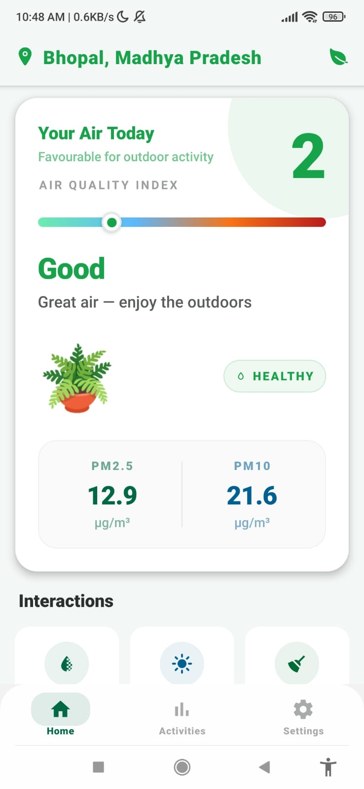
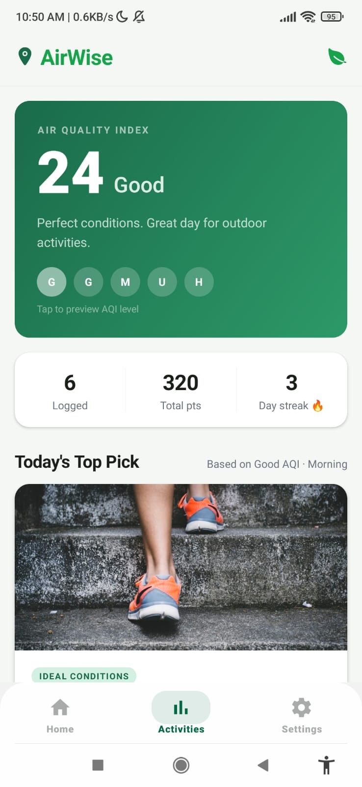
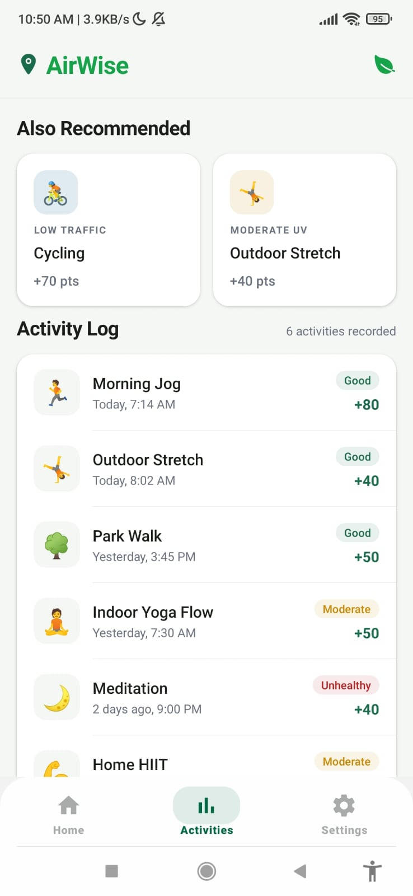
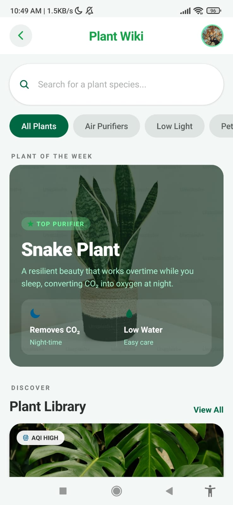
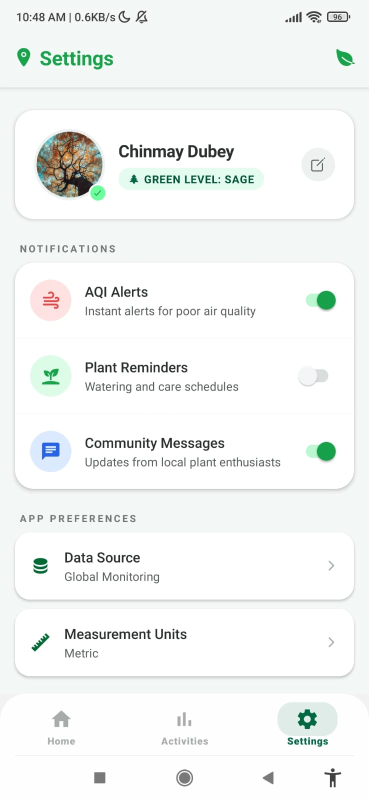
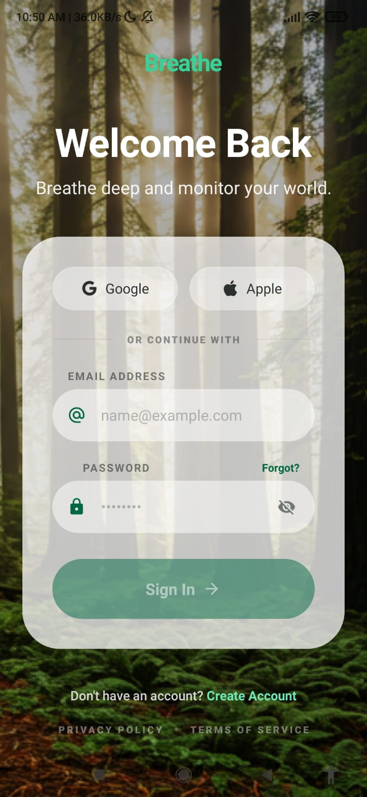

# 🌿 Atmo-Care (AirWise)

> A gamified environmental wellness app built with React Native & Expo

Atmo-Care is a beautifully crafted mobile application that helps users stay aware of their environment while building healthy, eco-friendly habits.  
It combines real-time AQI insights, smart recommendations, and gamification to create an engaging daily experience.

---

## 📸 Screenshots

<p align="center">
  
  
  
</p>

<p align="center">
  
  
  
</p>

## ✨ Features

### 🌍 Real-Time AQI Monitoring

- Fetches live Air Quality Index (AQI)
- Tracks PM2.5 and PM10 levels
- Location-based data using OpenWeather API

### 🧠 Smart Recommendations

- Suggests activities based on AQI + time of day
- Examples:
  - 🌅 Morning Jog (good AQI)
  - 🧘 Indoor Yoga (poor AQI)

### 🎮 Gamification & Streaks

- Earn points for:
  - 💧 Drinking water
  - ☀️ Sun exposure
  - 🧹 Cleaning
- Maintain daily streaks

### 🌱 Plant Wiki

- Air-purifying plant library
- Care instructions
- Beginner-friendly guides

### 🔐 Authentication

- Email login
- Google & Apple sign-in
- Powered by Clerk

### 🎨 UI/UX

- Smooth animations (`react-native-reanimated`)
- Glass effects
- Intuitive tab navigation via Expo Router

---

## 🛠 Tech Stack

| Layer     | Technology                                                        |
| --------- | ----------------------------------------------------------------- |
| Framework | React Native + Expo (SDK 55)                                      |
| Routing   | Expo Router (file-based)                                          |
| Auth      | Clerk for Expo                                                    |
| Location  | `expo-location`                                                   |
| Data      | OpenWeather Air Pollution API                                     |
| UI        | `expo-linear-gradient`, `expo-glass-effect`, `@expo/vector-icons` |

---

## 📂 Project Structure

```bash
client/
├── app/
│   ├── (auth)/           # Login & Signup screens
│   ├── (tabs)/           # Home, Activities, Settings
│   ├── components/       # Reusable UI components
│   ├── profile/          # User profile flows
│   └── wiki/             # Plant Wiki screens
│
├── src/
│   ├── api/              # API calls (e.g. getAQI.ts)
│   ├── constants/        # Theme, colors, configs
│   ├── hooks/            # Custom hooks (useSocialAuth, useAQIAnimations)
│   ├── types/            # TypeScript interfaces
│   └── utils/            # Helpers (Recommendations, UserUtils)
│
└── package.json
```

---

## 🚀 Getting Started

### 1. Prerequisites

- Node.js (v18+)
- Expo CLI

```bash
npm install -g expo-cli
```

- Expo Go app on your device

### 2. Installation

```bash
git clone https://github.com/ChinmayDubey231/atmo-care.git
cd atmo-care/client
npm install
```

### 3. Environment Variables

Create a `.env` file in the `client/` directory:

```env
EXPO_PUBLIC_CLERK_PUBLISHABLE_KEY=your_clerk_key

EXPO_PUBLIC_OPEN_WEATHER_API_KEY=your_openweather_key
EXPO_PUBLIC_OPEN_WEATHER_URL=https://api.openweathermap.org/data/2.5/air_pollution
```

### 4. Run the App

```bash
npm start
```

- Press `a` → Android emulator
- Press `i` → iOS simulator
- Scan QR code → Expo Go on device

---

## 🚧 Current Status

> No backend yet — uses local state and mock data for activity logs, streaks, and plant wiki.

---

## 🔮 Roadmap

- [ ] Backend integration (Supabase / Firebase) for persistent data
- [ ] Push notifications for AQI alerts and plant care reminders
- [ ] Community leaderboards and social features

---

## 👤 Author

**Chinmay Dubey** — [@ChinmayDubey231](https://github.com/ChinmayDubey231)
